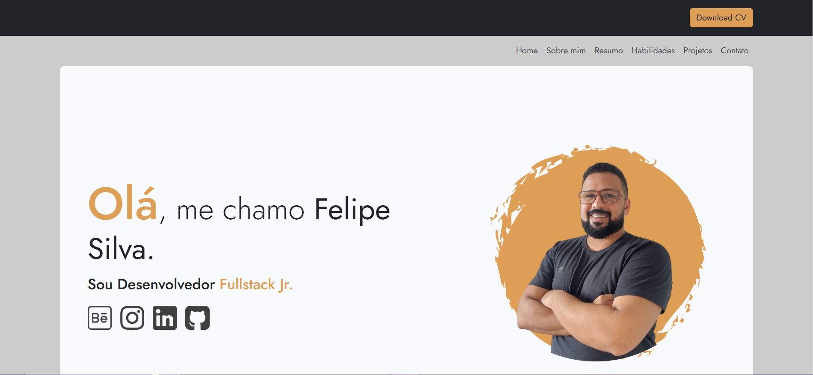

# ✔ Portifolio Pessoal

## <a href="https://portifolio-felipe-silva-three.vercel.app/" target="_blank">Ir para o portifolio</a> 
## Preview

# Introdução

O meu portfólio foi desenvolvido para apresentar minhas habilidades, experiências e projetos de forma profissional. Tem como objetivo ser uma ferramenta de marketing pessoal, que pode ser compartilhada com potenciais empregadores, clientes ou parceiros. O portfólio é responsivo, intuitivo e destaca os  meus principais pontos fortes.

## Estrutura do Portfólio

- Objetivo: Recepcionar os visitantes com uma breve apresentação do meu trabalho
- Elementos principais:
- Felipe Silva's Portifolio.
- "Transformar ideias em soluções criativas e funcionais, com foco na qualidade e inovação, contribuindo para um mundo mais conectado e eficiente."

## Tecnologias Utilizadas

- ✔ **Frontend**:
  -  Para estruturar as páginas da interface de usuário.
  -  para estilizar as páginas já contendo a responsividade
  -  Para estilizar alguns elementos para tornar a interface mais amigável.
  -  Para interatividade, como validação de formulários e buscas dinâmicas.
  
- **Backend**:
  -  Utilizado para processar as requisições, gerenciar a lógica de negócio e interagir com o banco de dados. 

- **Hospedagem**:
  -  Utilizado para hospedar o site e as funcionalidades do site / landing page do portifolio

# **Obrigado!**
